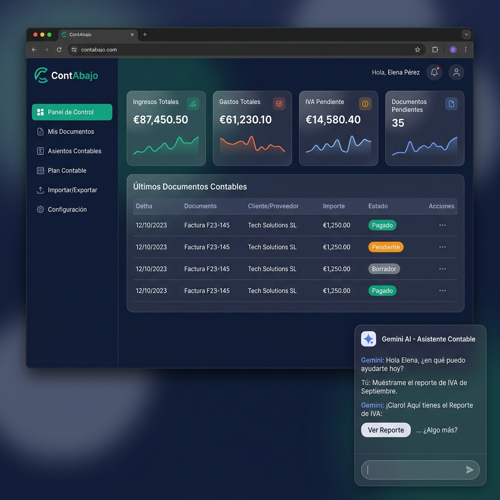
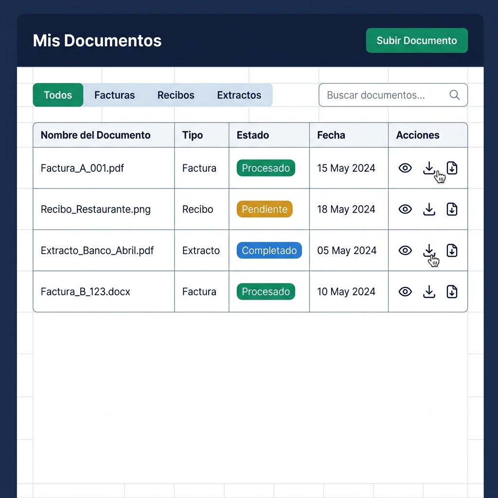
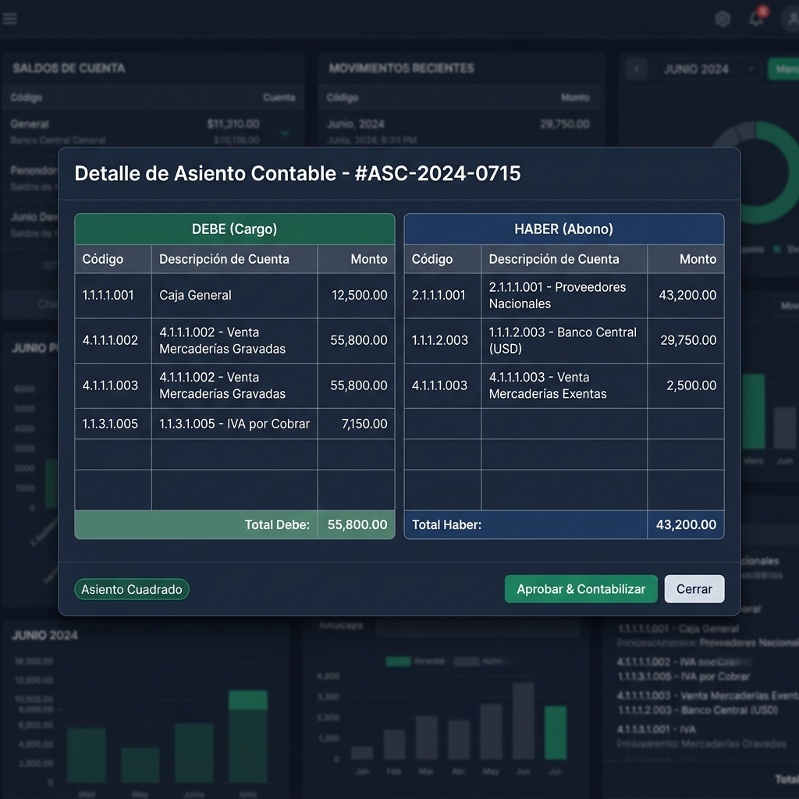
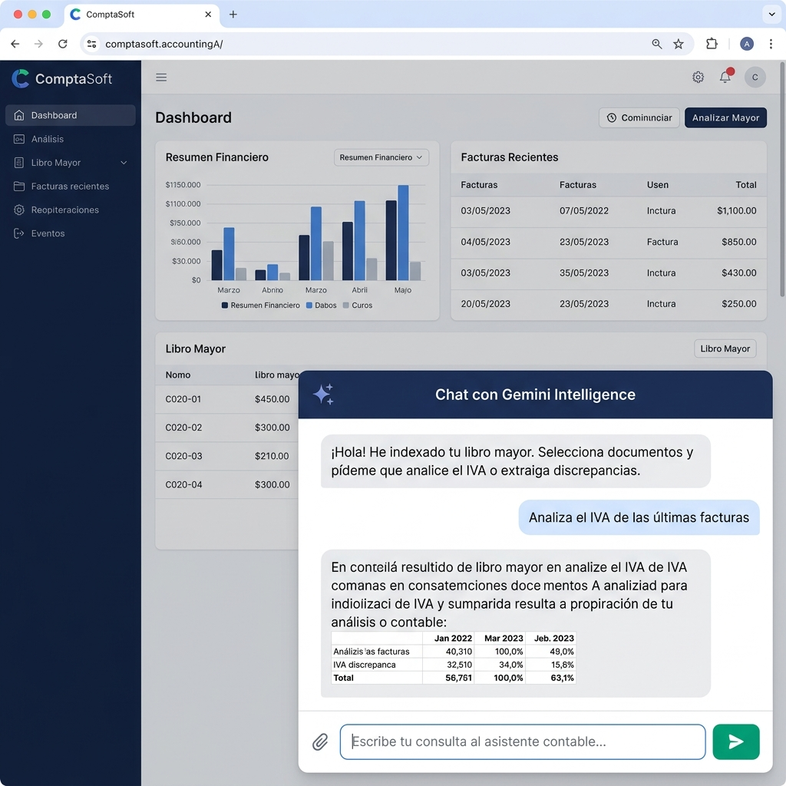
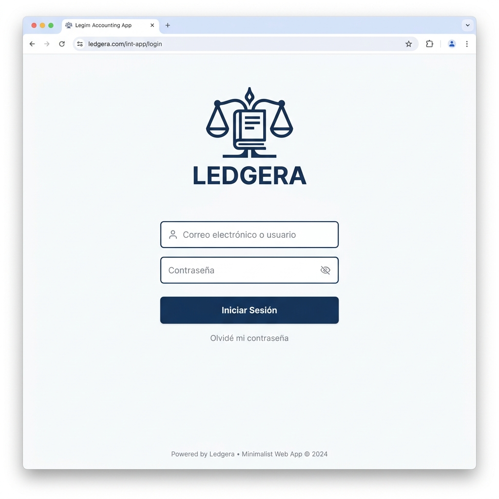

<div align="center">

# ⚖️ Balance AI

### Sistema Contable Empresarial Inteligente con Google Gemini AI

**Automatiza tu contabilidad. Simplifica tu empresa. Potenciado por IA.**

[](https://nextjs.org/)
[](https://www.typescriptlang.org/)
[](https://ai.google.dev/)
[](https://supabase.com/)
[](LICENSE)
[]()

[🚀 Ver Demo](#) · [📖 Documentación](#instalación) · [🐛 Reportar Bug](https://github.com/manueladolfo/balance-ai/issues)

---



</div>

---

## 🧾 ¿Qué es Balance AI?

**Balance AI** es una aplicación web de **contabilidad empresarial inteligente** diseñada para PYMES, autónomos y asesorías que desean eliminar la introducción manual de asientos contables.

La aplicación integra **Google Gemini AI** como motor de análisis documental, procesando automáticamente facturas, recibos y extractos bancarios para generar los asientos contables correspondientes según el **Plan General Contable español (PGC 2007)**, con exportación nativa a **ContaPlus (Sage)**.

> 💡 **¿Por qué Balance AI?** Mientras un contable tarda entre 5 y 15 minutos en introducir un asiento manualmente, Balance AI lo hace en segundos, con validación automática y cuadre garantizado.

---

## ✨ Funcionalidades Principales

### 📂 Gestión Inteligente de Documentos



Sube y gestiona todos tus documentos contables desde un único panel centralizado.

| Característica | Descripción |
|---|---|
| 📎 **Subida multi-formato** | Admite PDF, imágenes (JPG, PNG) y archivos CSV |
| 🔍 **Análisis automático** | Extracción de datos via OCR + Google Gemini AI |
| 🏷️ **Clasificación automática** | Facturas, recibos, extractos bancarios y nóminas |
| 🔎 **Filtros avanzados** | Por tipo, estado, fecha y búsqueda por texto libre |
| 📊 **Estados en tiempo real** | Pendiente · Procesando · Procesado · Completado |
| ⬇️ **Descarga del original** | Recupera el documento fuente en cualquier momento |

---

### 📒 Asientos Contables Automáticos según PGC 2007



El corazón de Balance AI: la generación automática de asientos contables validados y cuadrados.

```
DEBE (Cargo)                          │  HABER (Abono)
────────────────────────────────────  │  ─────────────────────────────────────
6280001  Suministros energía eléct.   │  4100055  Acreedores prest. servicios
         202,73 €                     │           245,30 €
4720021  HP, IVA Soportado 21%        │
          42,57 €                     │
────────────────────────────────────  │  ─────────────────────────────────────
TOTAL DEBE:  245,30 €                 │  TOTAL HABER:  245,30 €  ✅ Cuadrado
```

**Características del visor de asientos:**
- ✅ **Cuadre automático** — Verificación instantánea Debe = Haber
- 🎨 **Código de color corporativo** — Azul (DEBE) y Verde (HABER)
- 🔢 **Subcuentas del PGC** — Visualizadas sin formato de puntos
- ⚠️ **Detección de alertas** — Subcuentas no registradas en el ERP
- 📄 **Comprobante PDF** — Generación del comprobante oficial descargable
- ✍️ **Aprobación con un clic** — Contabilización directa desde el modal

---

### 📤 Exportación a ContaPlus (Sage)

Exporta tus asientos aprobados directamente a tu software de gestión.

```
💾 Formatos de exportación disponibles:

  ┌─────────────────────────────────────────┐
  │  📊  CSV — ContaPlus 2008               │
  │  📄  TXT — ContaPlus 2011               │
  └─────────────────────────────────────────┘
```

- **ContaPlus 2008**: Formato CSV con delimitador de punto y coma, compatible con versiones antiguas
- **ContaPlus 2011**: Formato TXT con estructura de campos fijos para importación directa
- **Exportación masiva**: Descarga todos los asientos aprobados en un solo archivo
- **Validación previa**: Solo se exportan asientos cuadrados y aprobados

---

### 🤖 Asistente Contable con Gemini AI



Un asistente conversacional especializado en contabilidad, disponible directamente en el panel de control.

**¿Qué puede hacer el asistente?**

| Consulta | Resultado |
|---|---|
| _"Analiza el IVA de las últimas facturas"_ | Resumen del IVA soportado y repercutido del período |
| _"¿Hay discrepancias en estos documentos?"_ | Detección de errores y diferencias en los importes |
| _"Categoriza los gastos del mes"_ | Clasificación por grupos del PGC (6xx Gastos) |
| _"Suma los importes seleccionados"_ | Totales instantáneos de las filas marcadas |
| _"Explica este asiento contable"_ | Descripción en lenguaje natural del asiento |

> 🔑 **Configura tu propia API Key de Gemini** directamente desde el panel de Configuración para acceder a todas las funcionalidades de IA en tiempo real.

---

### 📊 Panel de Control (Dashboard)

Vista panorámica del estado financiero de tu empresa.

```
┌──────────────────┬──────────────────┬──────────────────┬──────────────────┐
│  💰 INGRESOS     │  📉 GASTOS       │  🏛️ IVA          │  📋 PENDIENTES   │
│  TOTALES         │  TOTALES         │  PENDIENTE       │                  │
│  45.230,50 €     │  31.840,20 €     │  2.847,30 €      │  12 documentos   │
└──────────────────┴──────────────────┴──────────────────┴──────────────────┘
```

**Incluye:**
- 📈 KPIs financieros en tiempo real actualizados tras cada procesamiento
- 📋 Tabla de documentos recientes con acceso directo al asiento
- 🤖 Módulo de chat Gemini AI integrado en el panel principal
- 🔗 Acceso rápido a todas las secciones de la aplicación

---

### 🔐 Sistema de Usuarios y Seguridad



**Autenticación y gestión de sesiones:**
- 🔑 **Login minimalista** — Diseño limpio con correo/usuario y contraseña
- 👥 **Cambio de sesión en caliente** — Alterna entre usuarios sin cerrar la app
- 🔒 **Pantalla de bloqueo** — Bloqueo por inactividad con validación de PIN
- 👤 **Menú de usuario** — Avatar interactivo con opciones de sesión
- ➡️ **Cierre de sesión** — Logout seguro con redirección al login

---

### ⚙️ Configuración y Sistema

Panel de configuración completo con monitorización del estado de todos los servicios.

```yaml
Sistema:
  ✅ Módulo Contable (PGC 2007):  Operativo
  ✅ Motor de IA (Gemini API):    Activo  [API Key configurada]
  ✅ Base de Datos (Supabase):    Conectada
  ✅ Exportación ContaPlus:       Disponible
  ⚙️ Plan de Cuentas (PGC):      247 cuentas indexadas
```

---

## 🛠️ Stack Tecnológico

```
┌─────────────────────────────────────────────────────────────────────────┐
│                          BALANCE AI — ARQUITECTURA                      │
├───────────────────────────────┬─────────────────────────────────────────┤
│  FRONTEND                     │  BACKEND                                │
│  ─────────────────────────    │  ────────────────────────────────────   │
│  Next.js 16.2 (Turbopack)     │  Next.js API Routes (Edge-ready)        │
│  React 18 + TypeScript        │  Supabase (PostgreSQL)                  │
│  Tailwind CSS (MD3 tokens)    │  Google Gemini API (Flash 1.5)          │
│  jsPDF (comprobantes)         │  Supabase Storage (documentos)          │
│  Material Symbols (iconos)    │                                         │
└───────────────────────────────┴─────────────────────────────────────────┘
```

| Tecnología | Versión | Propósito |
|---|---|---|
| **Next.js** | 16.2 + Turbopack | Framework full-stack y servidor de API Routes |
| **TypeScript** | 5.x | Tipado estático y seguridad en tiempo de compilación |
| **React** | 18 | Componentes de interfaz de usuario reactivos |
| **Tailwind CSS** | 3.x | Sistema de diseño con tokens Material Design 3 |
| **Supabase** | 2.x | Base de datos PostgreSQL y almacenamiento de archivos |
| **Google Gemini AI** | Flash 1.5 | Motor de IA para análisis contable y chat |
| **jsPDF** | 2.x | Generación de comprobantes PDF descargables |
| **Material Symbols** | Latest | Iconografía de interfaz de usuario |

---

## 🚀 Instalación y Configuración

### Prerrequisitos

```bash
Node.js >= 18.x
npm >= 9.x
```

### 1. Clona el repositorio

```bash
git clone https://github.com/manueladolfo/balance-ai.git
cd balance-ai
```

### 2. Instala las dependencias

```bash
npm install
```

### 3. Configura las variables de entorno

Crea el archivo `.env.local` en la raíz del proyecto:

```env
# Google Gemini AI (obligatorio para funcionalidades de IA)
GEMINI_API_KEY=tu_clave_api_aqui

# Supabase (opcional - para producción con base de datos real)
NEXT_PUBLIC_SUPABASE_URL=https://tu-proyecto.supabase.co
NEXT_PUBLIC_SUPABASE_ANON_KEY=tu_clave_anonima_aqui
SUPABASE_SERVICE_ROLE_KEY=tu_clave_de_servicio_aqui
```

> 💡 **Sin Supabase**, la aplicación funciona en modo local con datos de demostración (`src/lib/mockDb.ts`).

### 4. Inicia el servidor de desarrollo

```bash
npm run dev
```

Abre [http://localhost:3000](http://localhost:3000) en tu navegador.

### 5. Construye para producción

```bash
npm run build
npm start
```

---

## 📁 Estructura del Proyecto

```
balance-ai/
├── public/
│   ├── logo.png                    # Logotipo de la aplicación
│   └── screenshots/                # Capturas de pantalla del README
├── src/
│   ├── app/
│   │   ├── api/
│   │   │   ├── analyze/route.ts    # 🤖 Análisis de documentos con Gemini
│   │   │   ├── chat/route.ts       # 💬 Chat conversacional con Gemini
│   │   │   ├── config/route.ts     # ⚙️ Gestión de configuración y API Keys
│   │   │   ├── documents/route.ts  # 📂 CRUD de documentos contables
│   │   │   ├── export/route.ts     # 📤 Exportación a ContaPlus
│   │   │   ├── pgc/route.ts        # 📒 Plan General Contable
│   │   │   └── upload/route.ts     # ⬆️ Subida de archivos
│   │   ├── globals.css             # 🎨 Sistema de diseño y tokens CSS
│   │   ├── layout.tsx              # 📐 Layout raíz con metadatos SEO
│   │   └── page.tsx                # 🏠 Página principal (app completa)
│   ├── components/
│   │   └── EntryModal.tsx          # 📋 Modal de detalle del asiento contable
│   └── lib/
│       ├── mockDb.ts               # 🗃️ Base de datos local para demostración
│       ├── mock_db.json            # 📄 Datos de prueba en JSON
│       └── supabase.ts             # 🔌 Cliente de Supabase
└── supabase/
    └── schema.sql                  # 🗄️ Esquema de la base de datos PostgreSQL
```

---

## 🗄️ Esquema de Base de Datos

```sql
-- Tabla principal de documentos contables
documents (id, name, type, status, created_at, storage_path)

-- Asientos contables por documento
accounting_entries (id, document_id, entry_date, entry_number, reference, concept, is_balanced)

-- Líneas de cada asiento (Debe/Haber)
entry_lines (id, entry_id, line_type, subaccount_code, subaccount_desc, amount)

-- Plan General Contable (PGC 2007)
pgc_accounts (id, code, description, account_type, group_number)
```

---

## 🔑 Cómo obtener tu API Key de Gemini

1. Visita [Google AI Studio](https://aistudio.google.com/app/apikey)
2. Inicia sesión con tu cuenta de Google
3. Haz clic en **"Create API Key"**
4. Copia la clave generada
5. En Balance AI → **Configuración** → pega la clave en el campo _"Configurar Clave API de Gemini"_ y guarda

> 🔒 La clave se almacena de forma segura en el servidor y nunca se expone al cliente.

---

## 🌐 Despliegue en Producción

### Vercel (recomendado)

```bash
# Instala la CLI de Vercel
npm install -g vercel

# Despliega
vercel --prod
```

Configura las variables de entorno en el panel de Vercel y listo.

### Docker

```dockerfile
FROM node:18-alpine
WORKDIR /app
COPY package*.json ./
RUN npm ci --only=production
COPY . .
RUN npm run build
EXPOSE 3000
CMD ["npm", "start"]
```

---

## 🤝 Contribuir

Las contribuciones son bienvenidas. Por favor, sigue estos pasos:

1. Haz **Fork** del repositorio
2. Crea una rama para tu funcionalidad: `git checkout -b feat/nueva-funcionalidad`
3. Realiza tus cambios y haz commit: `git commit -m 'feat: añade nueva funcionalidad'`
4. Sube la rama: `git push origin feat/nueva-funcionalidad`
5. Abre un **Pull Request** con descripción detallada

### Convención de commits

```
feat:     Nueva funcionalidad
fix:      Corrección de bug
docs:     Cambios en documentación
style:    Cambios de formato/estilo sin afectar lógica
refactor: Refactorización de código
```

---

## 📋 Roadmap

- [x] ✅ Procesamiento de documentos con Gemini AI
- [x] ✅ Generación automática de asientos PGC 2007
- [x] ✅ Exportación a ContaPlus (CSV/TXT)
- [x] ✅ Chat IA integrado en el dashboard
- [x] ✅ Sistema de usuarios y pantalla de bloqueo
- [x] ✅ Modal de asiento estilo libro mayor
- [ ] 🔲 Integración directa con APIs de Sage y A3
- [ ] 🔲 Módulo de conciliación bancaria automatizada
- [ ] 🔲 Informes fiscales (Modelo 303, 111, 115)
- [ ] 🔲 Aplicación móvil nativa (React Native)
- [ ] 🔲 Multi-empresa y multi-divisa
- [ ] 🔲 Firma electrónica de documentos

---

## 📄 Licencia

Este proyecto está bajo la Licencia MIT. Consulta el archivo [LICENSE](LICENSE) para más detalles.

---

<div align="center">

**Desarrollado con ❤️ por [Manuel Adolfo](https://github.com/manueladolfo)**

*Balance AI — Contabilidad inteligente para empresas modernas*

[](https://github.com/manueladolfo/balance-ai/stargazers)
[](https://github.com/manueladolfo/balance-ai/network/members)

</div>
